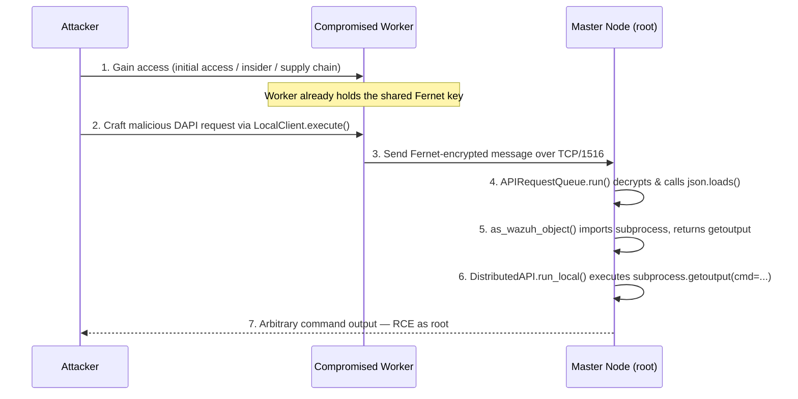

<div align="center">

# CVE-2026-25769

**Remote Code Execution on the Wazuh Master Node through a Compromised Worker Node**

[](https://nvd.nist.gov/vuln/detail/CVE-2026-25769)
[](#)
[](#)
[](https://cwe.mitre.org/data/definitions/502.html)
[](#)

</div>

---

## Overview

**Wazuh** is an open-source platform for threat prevention, detection, and response, commonly deployed in a **master/worker cluster architecture**. Versions **4.0.0 through 4.14.2** contain a critical **Remote Code Execution (RCE)** vulnerability caused by **unsafe deserialization of untrusted data** in the cluster communication layer.

Any organization where a worker node is compromised — through initial access, an insider threat, or a supply-chain attack — can be pivoted into **full root-level RCE on the master node**, which aggregates every alert, log, and detection rule across the deployment.

> ⚠️ This document summarizes publicly disclosed vulnerability details for defensive and educational purposes. It does not contain a working exploit.

---

## At a Glance

| Field | Value |
|---|---|
| **CVE ID** | [CVE-2026-25769](https://nvd.nist.gov/vuln/detail/CVE-2026-25769) |
| **Severity** | Critical |
| **CVSS 3.1 Score** | `9.1` (`AV:N/AC:L/PR:H/UI:N/S:C/C:H/I:H/A:H`) |
| **CWE** | [CWE-502 — Deserialization of Untrusted Data](https://cwe.mitre.org/data/definitions/502.html) |
| **Affected Versions** | `4.0.0` – `4.14.2` |
| **Patched Version** | `4.14.3` |
| **Attack Vector** | Network (TCP/1516, cluster channel) |
| **Privileges Required** | High (authenticated worker node) |
| **Impact** | Full RCE as root on master node |

---

## Architecture Context

In a Wazuh cluster, one **master** coordinates one or more **worker nodes**, all communicating over **TCP port 1516**. Messages are encrypted with a shared **Fernet key** defined in `ossec.conf`, ensuring only nodes possessing the correct key can exchange data.

The flaw is not in the encryption — it's in what happens **after** decryption: **the master implicitly trusts the content of any message from an authenticated worker.**

```
 🔒
 Master Server ───── TCP/1516 (Fernet-encrypted) ─────▶ Worker Node ✅
 │
 ├──── TCP/1516 ─────▶ Worker Node ✅
 │
 └──── TCP/1516 ─────▶ Worker Node ✅ (compromised)
```

Once a worker is compromised, the attacker already possesses everything needed to send **authenticated, trusted, malicious messages** to the master.

---


## ⛓️ Attack Chain



---


### Primary Fix
**Upgrade to Wazuh `4.14.3` or later.** The patch introduces an allowlist that blocks arbitrary module imports during deserialization.


<div align="center">

*This REPORT is intended for defensive security research, patch prioritization, and awareness. Always test upgrades in a staging environment before applying to production clusters.*

</div>
