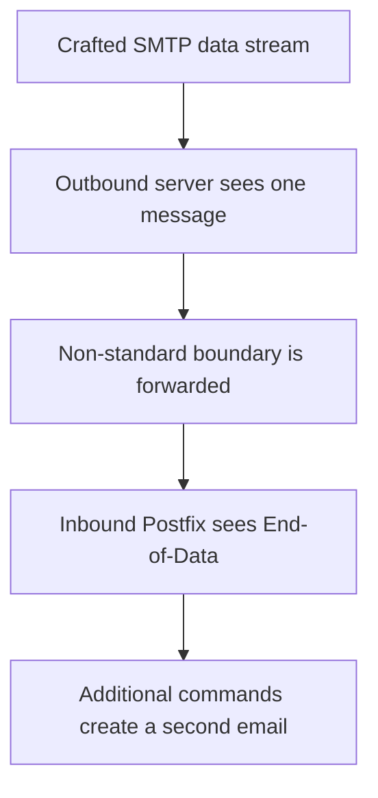

# CVE-2023-51764: Postfix SMTP Smuggling

[](https://nvd.nist.gov/vuln/detail/CVE-2023-51764)
[](https://nvd.nist.gov/vuln/detail/CVE-2023-51764)
[](https://cwe.mitre.org/data/definitions/345.html)

## Overview

CVE-2023-51764 is an SMTP smuggling vulnerability associated with inconsistent
interpretation of SMTP message boundaries. An outbound SMTP server may treat a
crafted data stream as one message and while receiving Postfix server interprets
the same stream as two separate messages.

In theory the attacker could then send another email with their own spoofed envelope
sender which, because of how we would identify who send it from an honest, legitimate
source, might actually pass SPF and, IF they make it possible for that send to also pass
DMARC (though there are complexities, as you could achieve via the SPF pathway) it could actually look more
legitimate than their normal email.

> This repository is intended for defensive research.

## Vulnerability Summary

| Field                | Value                                                                                                      |
| -------------------- | ---------------------------------------------------------------------------------------------------------- |
| CVE                  | [CVE-2023-51764](https://nvd.nist.gov/vuln/detail/CVE-2023-51764)                                          |
| Product              | Postfix SMTP server                                                                                        |
| Weakness             | [CWE-345: Insufficient Verification of Data Authenticity](https://cwe.mitre.org/data/definitions/345.html) |
| CVSS v3.1            | 5.3 - Medium                                                                                               |
| Vector               | `CVSS:3.1/AV:N/AC:L/PR:N/UI:N/S:U/C:N/I:L/A:N`                                                             |
| Attack type          | SMTP smuggling / email spoofing                                                                            |
| Main security impact | Message integrity and sender authenticity                                                                  |
| Discovery            | Timo Longin, SEC Consult                                                                                   |
| Publication date     | 24 December 2023                                                                                           |

## Normal SMTP Delivery


1. The user sends an email through a Mail User Agent(MUA) such as Outlook or
   Thunderbird.
2. The client authenticates to an outbound SMTP server, usually on TCP port 587.
3. The outbound server performs a DNS MX lookup for the recipient domain.
4. It connects to the recipient's inbound SMTP server on TCP port 25.
5. SMTP message data ends with the standard sequence:

   ```text
   <CRLF>.<CRLF>
   ```

## Root Cause

The vulnerability appears when two SMTP implementations disagree about where
message data ends. (EOD → End Of Data)

* The outbound server accepts only the standard `<CRLF>.<CRLF>` sequence and
  therefore sees one continuous message.
* The receiving server accepts a non-standard sequence, such as
  `<LF>.<CR><LF>`, as an End-of-Data marker.
* Since the first server's data, which is understood as an email body portion, is new to the second server, it will be parsed as more SMTP commands and an additional email.



## Conceptual Attack Flow

The following example is intentionally simplified and is not a ready-to-use
exploit:

```text
Legitimate SMTP envelope
DATA
Visible message headers and body
[non-standard End-of-Data sequence]
Additional SMTP transaction
Second message headers and body
[standard End-of-Data sequence]
```

The parser disagreement produces two different views:

| Outbound SMTP server                        | Inbound SMTP server                            |
| ------------------------------------------- | ---------------------------------------------- |
| Sees one message                            | Sees two messages                              |
| Treats the false terminator as body content | Treats the false terminator as End-of-Data     |
| Forwards the complete stream                | Processes the remaining bytes as SMTP commands |


## Affected and Fixed Versions

The NVD description covers vulnerable Postfix behavior through the 3.8.x line.
The long-term `smtpd_forbid_bare_newline` control was introduced or backported in:

* Postfix 3.5.23;
* Postfix 3.6.13;
* Postfix 3.7.9;
* Postfix 3.8.4;
* Postfix 3.9 and later.


### Mitigation tactics is given in the appropraite file named by Postfix-SMTP-Smuggling.pdf


## References

* [Postfix: SMTP Smuggling](https://www.postfix.org/smtp-smuggling.html)
* [NVD: CVE-2023-51764](https://nvd.nist.gov/vuln/detail/CVE-2023-51764)
* [SEC Consult: SMTP Smuggling - Spoofing E-Mails Worldwide](https://sec-consult.com/blog/detail/smtp-smuggling-spoofing-e-mails-worldwide/)
* [MITRE: CWE-345](https://cwe.mitre.org/data/definitions/345.html)
* [RFC 5321: Simple Mail Transfer Protocol](https://www.rfc-editor.org/rfc/rfc5321)

## Disclaimer

Use this information only on systems you own or are explicitly authorized to
test. The maintainers accept no responsibility for unauthorized or harmful use.
